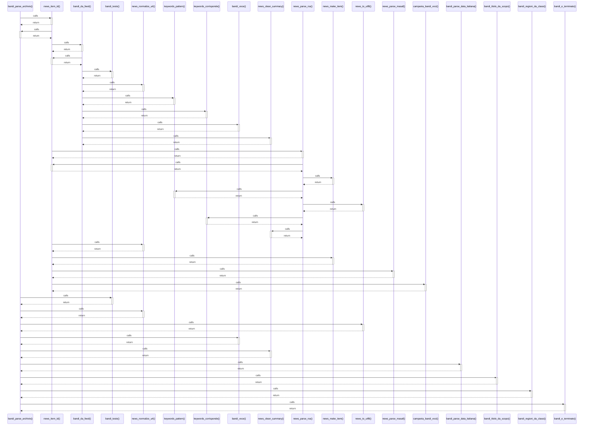

# bandi_parse_archivio()

> God node · 11 connections · [C:\Users\giang\Progetti Claude\masaf-decreti-pesca\lib\bandi_parser.php](file:///C:/Users/giang/Progetti%20Claude/masaf-decreti-pesca/lib/bandi_parser.php#L87)

## Call Trace Diagram

## Connections by Relation

### calls
- [[news_item_id()]] `INFERRED`
- [[bandi_testo()]] `INFERRED`
- [[news_normalize_url()]] `INFERRED`
- [[news_to_utf8()]] `INFERRED`
- [[bandi_voce()]] `EXTRACTED`
- [[news_clean_summary()]] `INFERRED`
- [[bandi_parse_data_italiana()]] `INFERRED`
- [[bandi_titolo_da_scopo()]] `INFERRED`
- [[bandi_regioni_da_classi()]] `INFERRED`
- [[bandi_e_terminato()]] `INFERRED`

### contains
- [[bandi_parser.php]] `EXTRACTED`

---

*Part of the graphify knowledge wiki. See [[index]] to navigate.*