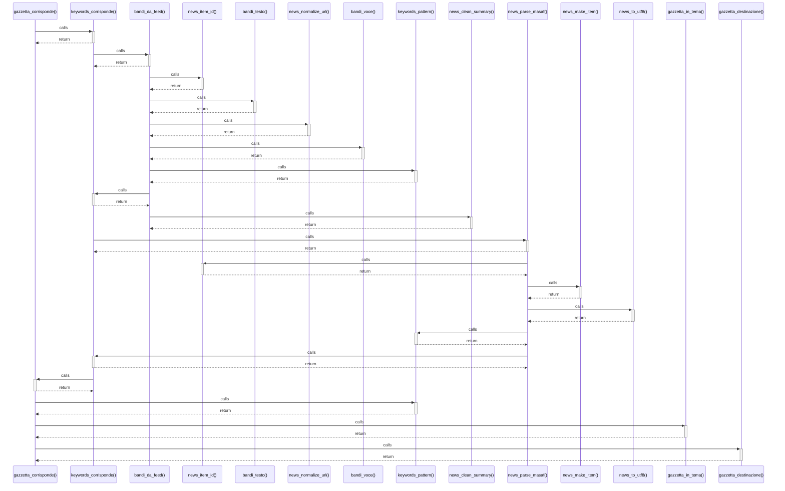

# gazzetta_corrisponde()

> God node · 5 connections · [C:\Users\giang\Progetti Claude\masaf-decreti-pesca\lib\gazzetta_parser.php](file:///C:/Users/giang/Progetti%20Claude/masaf-decreti-pesca/lib/gazzetta_parser.php#L333)

## Call Trace Diagram

## Connections by Relation

### calls
- [[keywords_corrisponde()]] `INFERRED`
- [[keywords_pattern()]] `INFERRED`
- [[gazzetta_in_tema()]] `EXTRACTED`
- [[gazzetta_destinazione()]] `EXTRACTED`

### contains
- [[gazzetta_parser.php]] `EXTRACTED`

---

*Part of the graphify knowledge wiki. See [[index]] to navigate.*