# Knowledge Graph Index

> Auto-generated by graphify. Start here — read community articles for context, then drill into god nodes for detail.

**185 nodes · 226 edges · 39 communities**

---

## System Architecture Flowchart

```mermaid
flowchart TD
    C0["Community 0 (29 nodes)"]
    C1["Community 1 (22 nodes)"]
    C2["Community 2 (15 nodes)"]
    C3["Community 3 (14 nodes)"]
    C4["Community 4 (13 nodes)"]
    C5["Community 5 (9 nodes)"]
    C6["Community 6 (8 nodes)"]
    C7["unknown (6 nodes)"]
    C8["Community 8 (6 nodes)"]
    C9["Community 9 (6 nodes)"]
    C10["Community 10 (5 nodes)"]
    C11["Community 11 (5 nodes)"]
    C12["unknown (5 nodes)"]
    C13["Community 13 (4 nodes)"]
    C14["unknown (3 nodes)"]
    C15["unknown (3 nodes)"]
    C16["unknown (3 nodes)"]
    C17["unknown (3 nodes)"]
    C18["unknown (3 nodes)"]
    C19["Community 19 (2 nodes)"]
    C20["unknown (2 nodes)"]
    C21["unknown (2 nodes)"]
    C22["unknown (1 nodes)"]
    C23["unknown (1 nodes)"]
    C24["unknown (1 nodes)"]
    C25["unknown (1 nodes)"]
    C26["unknown (1 nodes)"]
    C27["unknown (1 nodes)"]
    C28["unknown (1 nodes)"]
    C29["unknown (1 nodes)"]
    C30["unknown (1 nodes)"]
    C31["unknown (1 nodes)"]
    C32["unknown (1 nodes)"]
    C33["unknown (1 nodes)"]
    C34["unknown (1 nodes)"]
    C35["unknown (1 nodes)"]
    C36["unknown (1 nodes)"]
    C37["unknown (1 nodes)"]
    C38["unknown (1 nodes)"]
    C4 -->|2 edges| C0
    C13 -->|1 edges| C1
    C0 -->|1 edges| C10
```

## Communities
(sorted by size, largest first)

- [[Community 0]] — 29 nodes
- [[Community 1]] — 22 nodes
- [[Community 2]] — 15 nodes
- [[Community 3]] — 14 nodes
- [[Community 4]] — 13 nodes
- [[Community 5]] — 9 nodes
- [[Community 6]] — 8 nodes
- [[unknown]] — 6 nodes
- [[Community 8]] — 6 nodes
- [[Community 9]] — 6 nodes
- [[Community 10]] — 5 nodes
- [[Community 11]] — 5 nodes
- [[unknown]] — 5 nodes
- [[Community 13]] — 4 nodes
- [[unknown]] — 3 nodes
- [[unknown]] — 3 nodes
- [[unknown]] — 3 nodes
- [[unknown]] — 3 nodes
- [[unknown]] — 3 nodes
- [[Community 19]] — 2 nodes
- [[unknown]] — 2 nodes
- [[unknown]] — 2 nodes
- [[unknown]] — 1 nodes
- [[unknown]] — 1 nodes
- [[unknown]] — 1 nodes
- [[unknown]] — 1 nodes
- [[unknown]] — 1 nodes
- [[unknown]] — 1 nodes
- [[unknown]] — 1 nodes
- [[unknown]] — 1 nodes
- [[unknown]] — 1 nodes
- [[unknown]] — 1 nodes
- [[unknown]] — 1 nodes
- [[unknown]] — 1 nodes
- [[unknown]] — 1 nodes
- [[unknown]] — 1 nodes
- [[unknown]] — 1 nodes
- [[unknown]] — 1 nodes
- [[unknown]] — 1 nodes

## God Nodes
(most connected concepts — the load-bearing abstractions)

- [[bandi_parse_archivio()]] — 11 connections
- [[rete_scarica()]] — 11 connections
- [[bandi_da_feed()]] — 8 connections
- [[news_item_id()]] — 8 connections
- [[bandi_testo()]] — 7 connections
- [[news_parse_rss()]] — 7 connections
- [[prova()]] — 7 connections
- [[campania_parse_atti()]] — 6 connections
- [[news_normalize_url()]] — 6 connections
- [[news_make_item()]] — 6 connections

---

*Generated by [graphify](https://github.com/safishamsi/graphify)*