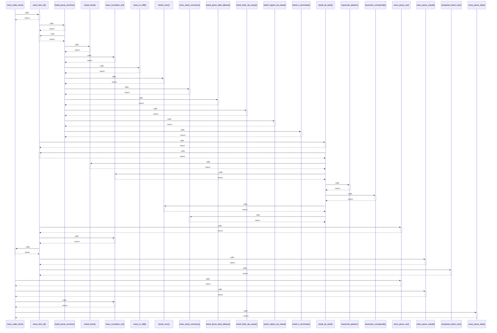

# news_make_item()

> God node · 6 connections · [C:\Users\giang\Progetti Claude\masaf-decreti-pesca\lib\news_parsers.php](file:///C:/Users/giang/Progetti%20Claude/masaf-decreti-pesca/lib/news_parsers.php#L11)

## Call Trace Diagram

## Connections by Relation

### calls
- [[news_item_id()]] `INFERRED`
- [[news_parse_rss()]] `EXTRACTED`
- [[news_parse_masaf()]] `EXTRACTED`
- [[news_normalize_url()]] `INFERRED`
- [[news_parse_date()]] `INFERRED`

### contains
- [[news_parsers.php]] `EXTRACTED`

---

*Part of the graphify knowledge wiki. See [[index]] to navigate.*