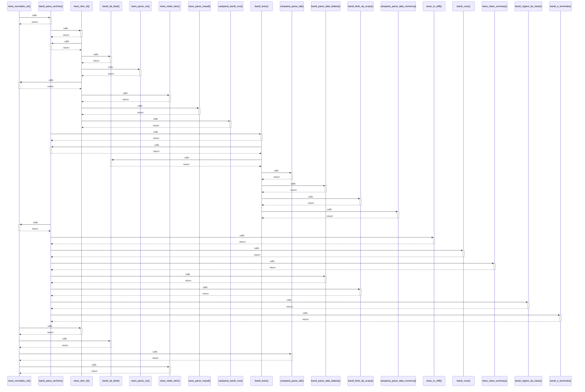

# news_normalize_url()

> God node · 6 connections · [C:\Users\giang\Progetti Claude\masaf-decreti-pesca\lib\news_normalize.php](file:///C:/Users/giang/Progetti%20Claude/masaf-decreti-pesca/lib/news_normalize.php#L9)

## Call Trace Diagram

## Connections by Relation

### calls
- [[bandi_parse_archivio()]] `INFERRED`
- [[news_item_id()]] `EXTRACTED`
- [[bandi_da_feed()]] `INFERRED`
- [[campania_parse_atti()]] `INFERRED`
- [[news_make_item()]] `INFERRED`

### contains
- [[news_normalize.php]] `EXTRACTED`

---

*Part of the graphify knowledge wiki. See [[index]] to navigate.*