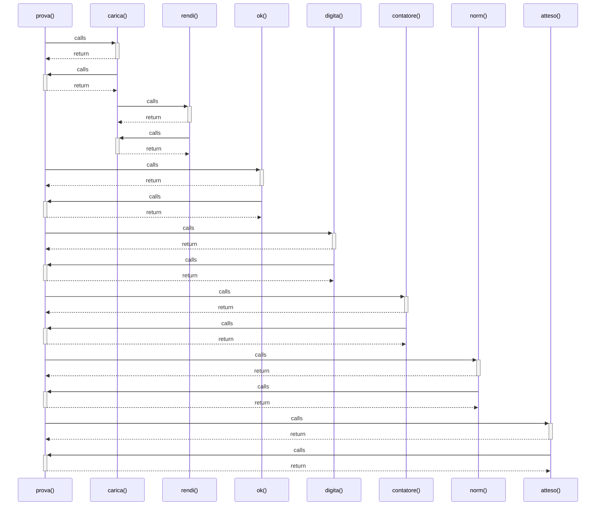

# prova()

> God node · 7 connections · [C:\Users\giang\Progetti Claude\masaf-decreti-pesca\tests\js\filters.test.mjs](file:///C:/Users/giang/Progetti%20Claude/masaf-decreti-pesca/tests/js/filters.test.mjs#L84)

## Call Trace Diagram

## Connections by Relation

### calls
- [[carica()]] `EXTRACTED`
- [[ok()]] `EXTRACTED`
- [[digita()]] `EXTRACTED`
- [[contatore()]] `EXTRACTED`
- [[norm()]] `EXTRACTED`
- [[atteso()]] `EXTRACTED`

### contains
- [[filters.test.mjs]] `EXTRACTED`

---

*Part of the graphify knowledge wiki. See [[index]] to navigate.*