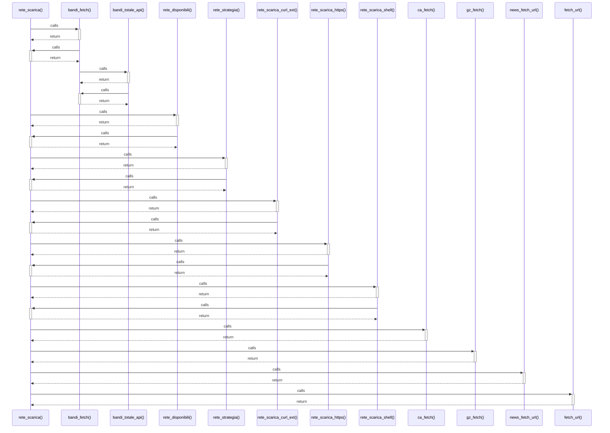

# rete_scarica()

> God node · 11 connections · [C:\Users\giang\Progetti Claude\masaf-decreti-pesca\lib\rete.php](file:///C:/Users/giang/Progetti%20Claude/masaf-decreti-pesca/lib/rete.php#L78)

## Call Trace Diagram

## Connections by Relation

### calls
- [[bandi_fetch()]] `INFERRED`
- [[rete_disponibili()]] `EXTRACTED`
- [[rete_strategia()]] `EXTRACTED`
- [[rete_scarica_curl_ext()]] `EXTRACTED`
- [[rete_scarica_https()]] `EXTRACTED`
- [[rete_scarica_shell()]] `EXTRACTED`
- [[ca_fetch()]] `INFERRED`
- [[gz_fetch()]] `INFERRED`
- [[news_fetch_url()]] `INFERRED`
- [[fetch_url()]] `INFERRED`

### contains
- [[rete.php]] `EXTRACTED`

---

*Part of the graphify knowledge wiki. See [[index]] to navigate.*